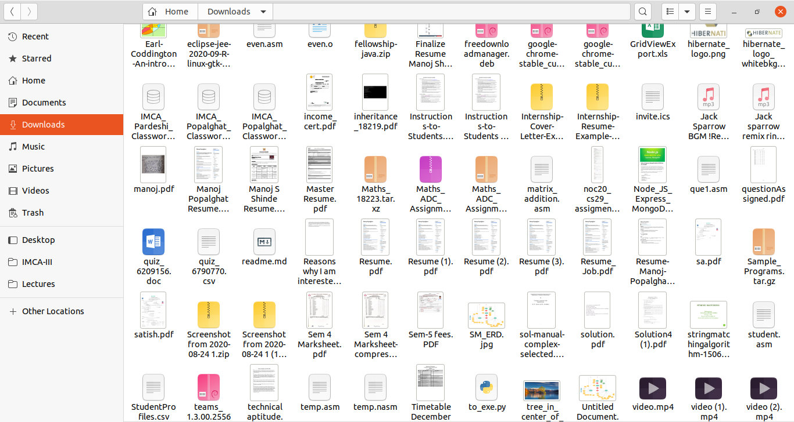

# Filter Files
## Filter your files of a directory

This project is written in Python and has a GUI desktop application.
It sorts corresponding files and moves them to the respective directory.
Like all music files move to the ‘Music’ directory. Generally, we download
many files and it resides in the download folder, so this software is
helpful to sort this problem.

## Used Modules
Tkinter for GUI purpose.
OS,Shutil for File's operations

# Before Filter

